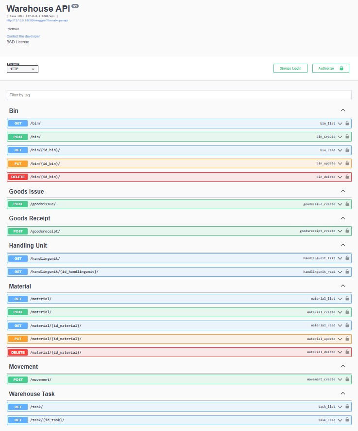

## Table of Contents

* [Project Title](#project-title)
* [Description](#description)
* [Features](#features)
* [Technology](#technology)

# Project Title

Warehouse

## Description

Scope of this project is a backend for warehouse application. The idea comes from real application SAP EWM.

  

## Features

A few of the things you can do with this application:

* Material master data management
* Bin management
* Goods Receipt - product on stock
* Goods Issue - product from stock
* Warehouse task management

## Technology

* Python 3.12
* Django 5.1
* DRF 3.15
* PostgreSQL 17.0
* Redis 7.0
* Nginx 1.27
* Docker-compose 2.29
